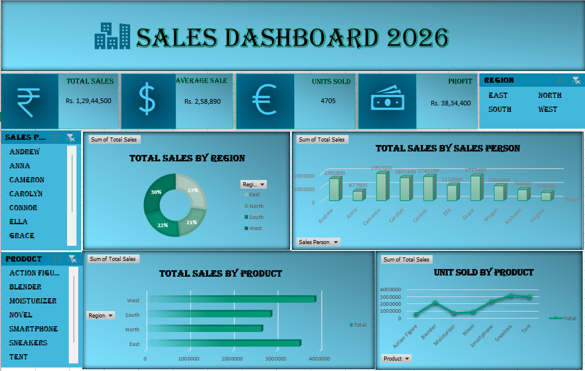

# 📊 Sales Dashboard 2026

An interactive **Sales Dashboard 2026** designed to provide a clear overview of sales performance, revenue, profit, units sold, regions, products, and individual sales-person performance.

## 🖼️ Dashboard Screenshot



> **Dashboard screenshot:** `dashboard.png`

## 🔗 Project Links

- **GitHub Repository:** https://github.com/karthikanirose1016-sketch/Sales_Dashboard_2026.git
- **Dashboard Screenshot:** `dashboard.png`

## 📌 Dashboard Overview

The Sales Dashboard provides an interactive view of business sales data through KPI cards, charts, filters, and regional/product analysis.

### Key Performance Indicators

The dashboard displays:

- 💰 **Total Sales:** Rs. 1,29,44,500
- 💵 **Average Sale:** Rs. 2,58,890
- 📦 **Units Sold:** 4,705
- 💹 **Profit:** Rs. 38,34,400

## 📈 Dashboard Visualizations

### 1. Total Sales by Region
A donut chart showing the distribution of total sales across:

- East
- North
- South
- West

### 2. Total Sales by Sales Person
A column chart comparing sales generated by individual sales representatives.

Sales representatives included:

- Andrew
- Anna
- Cameron
- Carolyn
- Connor
- Ella
- Grace
- Megan
- Nicholas
- Virginia

### 3. Total Sales by Product
A bar chart showing sales performance across different product categories.

Products include:

- Action Figure
- Blender
- Moisturizer
- Novel
- Smartphone
- Sneakers
- Tent

### 4. Units Sold by Product
A line chart showing the number of units sold for each product.

## 🎛️ Dashboard Filters

The dashboard includes interactive filters for:

- **Sales Person**
- **Product**
- **Region**

These filters allow users to explore the sales data dynamically.

## 🛠️ Tools & Technologies

- Microsoft Excel
- Pivot Tables
- Pivot Charts
- Excel Slicers
- Dashboard Design
- Data Analysis & Visualization

## 📂 Project Structure

```text
sales-dashboard-2026/
│
├── README.md
├── Sales_Dashboard_2026.xlsx
└── dashboard.png
````

 ## 🚀 How to Use

 1. Download or clone the repository.
2. Open `Sales_Dashboard_2026.xlsx` in Microsoft Excel.
3. Use the available slicers to filter the dashboard.
4. Explore sales performance by region, salesperson, and product.

 ## 📊 Key Insights

 The dashboard makes it easier to analyze:

 - Overall sales performance
- Regional sales contribution
- Individual salesperson performance
- Product-wise sales
- Product-wise units sold
- Profit and average sales
- Business performance through interactive filtering

 ## 👤 Author

 **Karthika**

 - GitHub: https://github.com/karthikanirose1016-sketch


---

 ⭐ If you find this project useful, consider giving the repository a star!


**GitHub repository URL**
```text
https://github.com/karthikanirose1016-sketch/Sales_Dashboard_2026.git
````

 **Dashboard screenshot URL inside GitHub**

```
https://github.com/karthikanirose1016-sketch/Sales_Dashboard_2026.git
```

 For the screenshot to display automatically in the README, put `dashboard.png` in the **root of your repository** and use:

```

```
